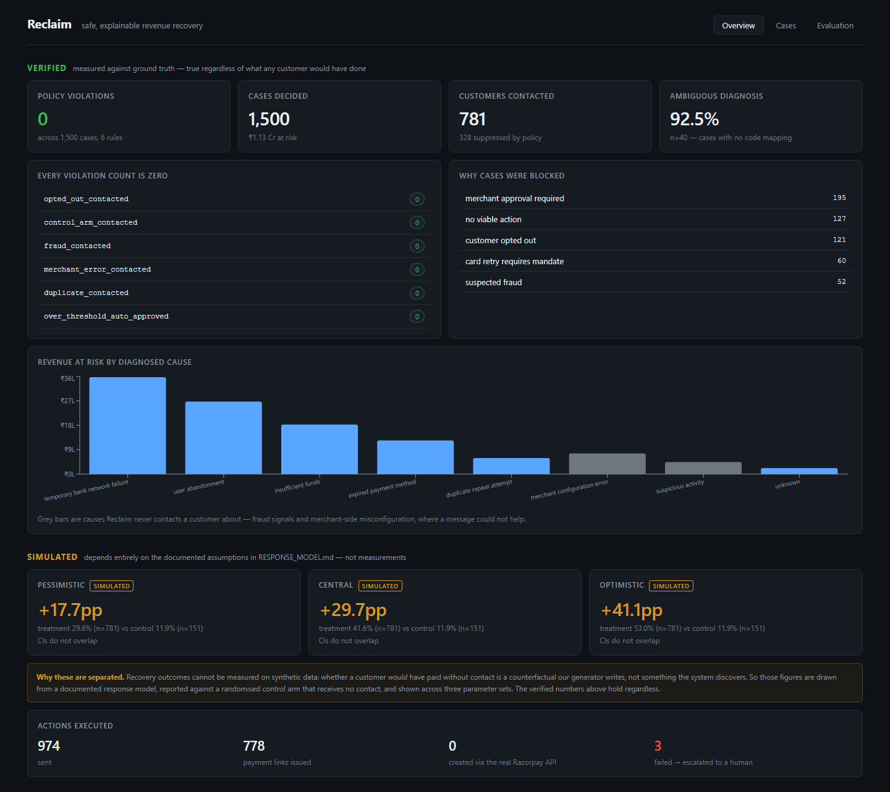
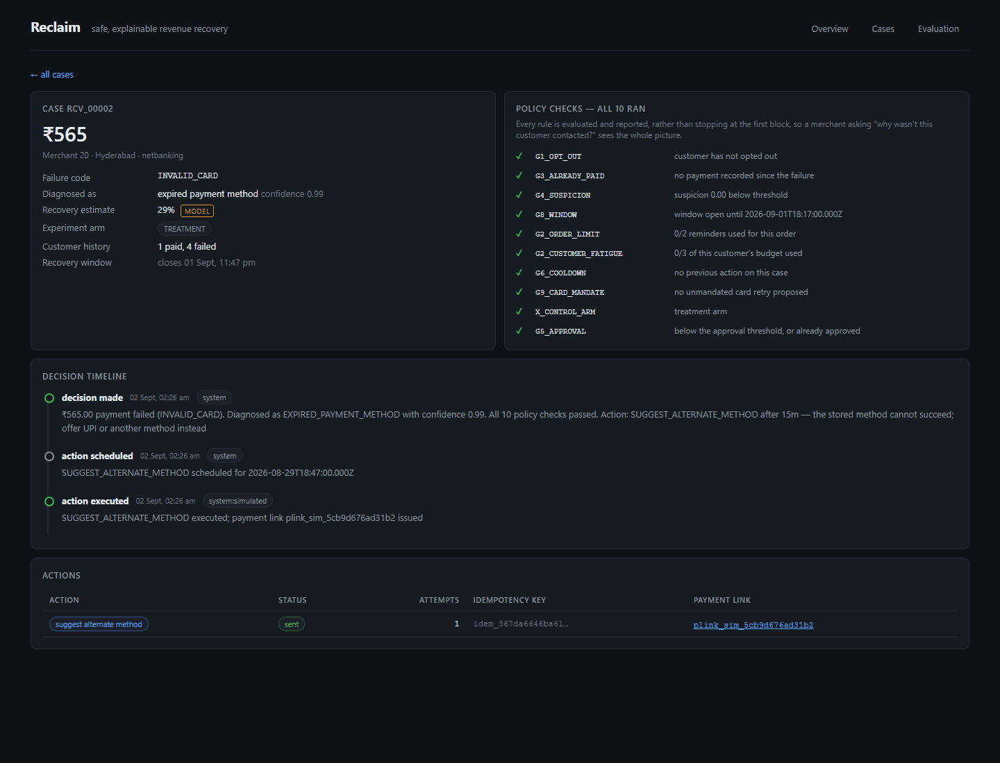
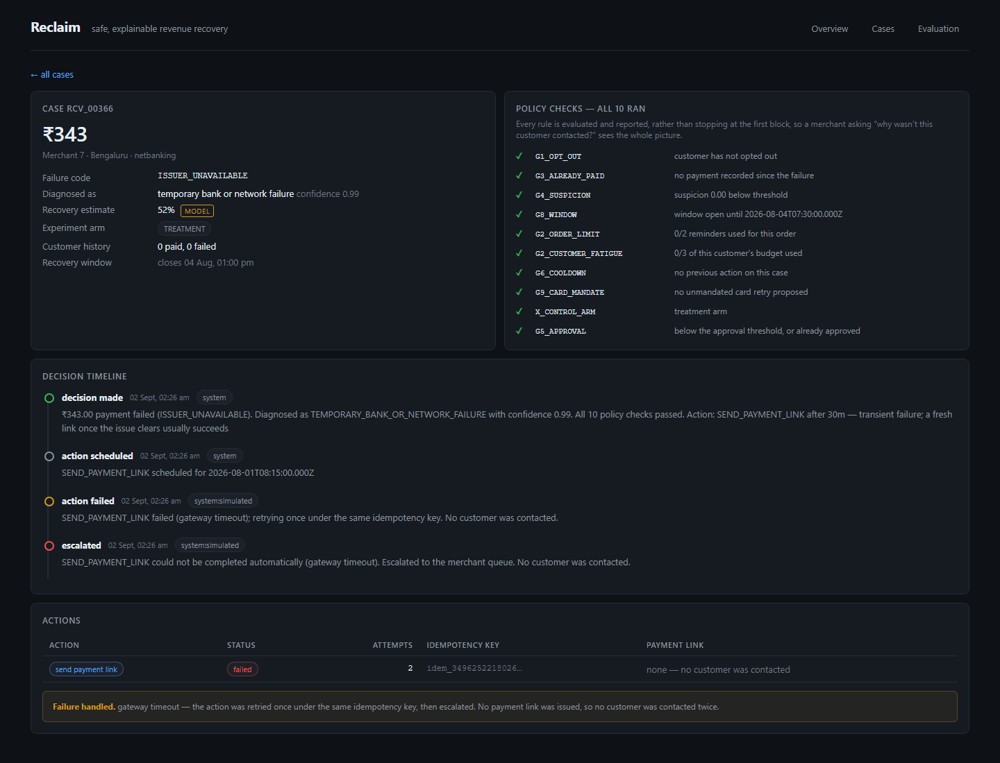

# Reclaim

[](https://github.com/Anamiiikka/Reclaim/actions/workflows/ci.yml)

**Safe, explainable revenue recovery for failed payments.**

Razorpay AI Buildathon — Track 3: AI Revenue Recovery.



---

## What it does

When a payment fails, most systems do one of two things: retry blindly, or send a reminder to
everyone. Both waste money and annoy customers.

Reclaim diagnoses *why* each payment failed, decides whether recovery is worth attempting, picks
one bounded action, and stops when continuing would harm the customer or the merchant. Every
decision is recorded with enough state to be replayed and reproduced exactly.

Across 1,500 synthetic recovery cases: **zero policy violations, 1,500/1,500 decisions replay
byte-identically**, and payment links created through Razorpay's live test-mode API.

---

## What we claim, and what we don't

This distinction runs through the whole project, and it is deliberate.

### Verified — measured against ground truth

| Metric | Value |
|---|---|
| Cases decided | 1,500 |
| **Policy violations** | **0** across 6 rules |
| Decision replay determinism | 1,500 / 1,500 identical |
| Ambiguous-case diagnosis accuracy | 92.5% (n=40) |
| Propensity model AUC, held-out | 0.723 |
| Customers contacted | 781 · 328 suppressed by policy |

These hold regardless of what any customer would have done.

### Simulated — depends on documented assumptions

| Scenario | Treatment | Control | Uplift |
|---|---|---|---|
| pessimistic | 29.6% | 11.9% | +17.7pp |
| central | 41.6% | 11.9% | +29.7pp |
| optimistic | 53.0% | 11.9% | +41.1pp |

Recovery outcomes **cannot be measured on synthetic data**. Whether a customer *would* have paid
without contact is a counterfactual our generator writes, not something the system discovers. So
those figures come from a documented response model ([RESPONSE_MODEL.md](RESPONSE_MODEL.md)),
reported against a randomised control arm that receives no contact, across three parameter sets,
with Wilson 95% intervals.

Full report: [evaluation/RESULTS.md](evaluation/RESULTS.md).

**Two numbers we deliberately do not headline.** Overall diagnosis accuracy is 99.8%, and that is
not a result — the generator writes a gateway code and the engine maps that same code back through
the same table, so agreement is arithmetic rather than inference. And a contact-everyone baseline
recovers ~13% *more* revenue than Reclaim by sending ~19% more messages. That is a trade-off, not a
defeat, and [RESULTS.md](evaluation/RESULTS.md) says so plainly.

---

## The guardrails

The part of this project that can be defended without qualification. All nine are pure functions
with no database, clock, or network access, and all of them run on every decision — the engine
never short-circuits on the first block, so a merchant asking "why wasn't this customer contacted?"
sees the complete picture.

| | Rule |
|---|---|
| G1 | Never contact a customer who has opted out |
| G2 | Max 2 reminders per order; max 3 per customer across all orders |
| G3 | Never contact after the payment succeeded |
| G4 | Fraud signals stop automation and route to a human |
| G5 | Merchant approval required above the merchant's threshold |
| G6 | Cool-down window between actions on one case |
| G7 | Idempotency keys prevent duplicate actions on event replay |
| G8 | Recovery stops 72 hours after the failure |
| G9 | Never auto-retry a card without an explicit mandate — link only |



The suite is mutation-tested: sabotaging G1 causes four tests to fail, confirming it detects
violations rather than passing vacuously.

---

## Failure handling

A payment-API failure must never result in a customer being contacted twice. Three mechanisms
enforce that, so no single mistake breaks it:

- Idempotency keys derived from case + action + sequence, never random, so a replayed event
  produces the same key
- A `UNIQUE` constraint on that key, so the database refuses a duplicate even if two workers race
- One retry maximum (`attempt_count <= 2`, also a constraint), and only for errors classified
  retryable



`npm run fail-demo` scripts API failures to show it. A permanent error escalates immediately; a
timeout retries once under the same key, then escalates. Both end with no payment link issued.

---

## Architecture

```
Python                          TypeScript                     Postgres (Neon)
─────────────────────────────   ────────────────────────────   ──────────────────
generate.py ────────────────►   detect.ts                      payment_attempts
  synthetic dataset               finds eligible cases    ───► recovery_cases
  + response model                       │                      audit_events
                                         ▼                      recovery_actions
train_model.py                    diagnose.ts                   scheduled_actions
  logistic regression               gateway code → cause
         │                               │
         │ model.json                    ▼
         └──────────────────────►  score.ts
                                    recovery propensity
                                         │
                                         ▼
                                   rules.ts  ← G1–G9, pure
                                         │
                                         ▼
                                    plan.ts
                                     one bounded action
                                         │
                                         ▼
                                  execute.ts ──► PaymentClient
                                    durable queue      ├─ SimulatedPaymentClient
                                    idempotency        └─ RazorpayPaymentClient
                                         │
evaluate.py  ◄───────────────────────────┘
  verified + simulated tiers
```

**Deliberate omissions.** No Redis or BullMQ — a Postgres table with `run_after` gives durable
delayed jobs in ~50 lines, and puts scheduling state in the database the dashboard already reads.
No Python service in the request path — a logistic regression is a dot product, so coefficients
are exported as JSON and scored in TypeScript, with a 40-row parity fixture asserting the
reimplementation matches scikit-learn to six decimals. No LLM anywhere in the money path.

---

## Running it

```bash
cp .env.example .env          # fill in DATABASE_URL
npm install
npm test                      # 110 TypeScript tests
pytest data/ evaluation/      # 39 Python tests
```

Full pipeline:

```bash
python data/generator/generate.py     # 5,000 synthetic payment attempts
python data/generator/load.py         # into Postgres
npm run detect                        # detect, diagnose, decide, audit
npm run actions                       # schedule and execute
npm run verify-replay                 # every decision reproduces exactly
npm run eval                          # regenerate the evaluation report
```

Dashboard — one process serves both the API and the built dashboard:

```bash
cd web && npm run build && cd ..
npm run api                   # http://localhost:3000
```

For hot reload while developing the dashboard, run them separately
(`npm run api` and `npm run web`; Vite proxies /api). Deployment steps are in
[docs/DEPLOYMENT.md](docs/DEPLOYMENT.md).

### Razorpay

Reclaim runs against a **simulator by default**, so it works with no keys and the tests never
touch the network. To use the real API:

```bash
# .env
RAZORPAY_KEY_ID=rzp_test_...
RAZORPAY_KEY_SECRET=...
PAYMENT_CLIENT=razorpay
```

```bash
npm run check-razorpay        # authenticates and creates one real ₹1 test link
```

**Test mode only.** The client refuses any key not starting with `rzp_test_`, fatally at
construction — this project has synthetic customers and no reason to hold a live key.

Razorpay's test mode is heavily rate limited (we measured 429s even at one request per second once
an account's quota is spent), so a run caps real link creation at 25 and routes the rest through
the simulator. That is a property of the sandbox, not of Reclaim.

---

## What we deliberately do not automate

Worth stating plainly, because the omissions are decisions rather than gaps.

- **Contacting anyone who opted out.** No override exists — not for a high-value order, not with
  merchant approval.
- **Acting on suspected fraud.** These escalate to a human. The customer may not be the account
  holder.
- **Spending above the merchant's threshold.** Held for approval; the action is planned but not
  executed.
- **Re-presenting a card without a mandate.** A payment link is offered instead — the customer
  re-authorises by using it.
- **Contacting customers about merchant-side misconfiguration.** They cannot fix it; the merchant
  is alerted.
- **Letting a model decide whether to contact.** The propensity score informs *which* action and
  whether the expected recovery justifies it. Whether contact is *permitted* is the policy
  engine's alone, and no score can override a block.
- **Retrying more than once after an API failure.** A second retry risks contacting someone whose
  first message actually went out.

---

## Limitations

- **Synthetic data.** Recovery outcomes are drawn from a documented model, not observed. The
  decision layer is real; the revenue figures are a simulation whose assumptions are written down.
- **Small control arm.** 151 cases. The confidence interval on its rate is wide, and the report
  says so rather than quoting a point estimate.
- **Delivery is out of scope.** Reclaim creates a real payment link; it does not send SMS or email.
  Test mode would not deliver them anyway.
- **The suspicion score is a stub.** The schema and policy support it; a real risk model would
  populate it.
- **Diagnosis is deterministic by design.** A gateway code is a fact, and mapping a fact to a
  category is a lookup. The model earns its place only where the code is missing or unrecognised.

---

## Repository

| Path | |
|---|---|
| [`src/policy/rules.ts`](src/policy/rules.ts) | G1–G9, pure functions |
| [`src/decisions/`](src/decisions/) | detect, diagnose, score, plan, audit, replay |
| [`src/actions/`](src/actions/) | durable queue, idempotency, failure handling |
| [`src/payments/`](src/payments/) | `PaymentClient` — simulator and Razorpay |
| [`tests/`](tests/) | 110 tests, including the guardrail suite |
| [`evaluation/`](evaluation/) | model training, harness, [RESULTS.md](evaluation/RESULTS.md) |
| [`RESPONSE_MODEL.md`](RESPONSE_MODEL.md) | every assumption behind a simulated number |
| [`web/`](web/) | React dashboard |

## Licence

MIT
